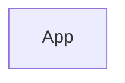
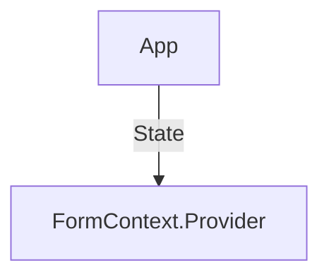
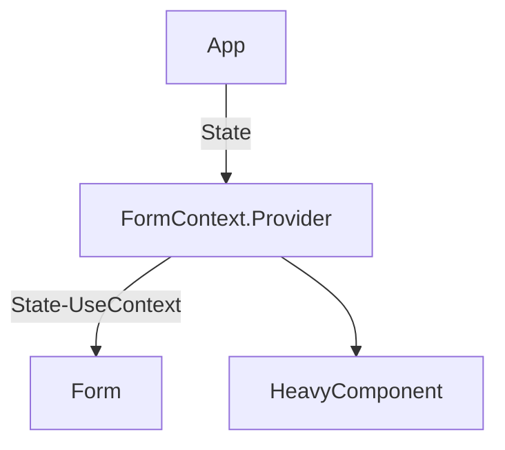
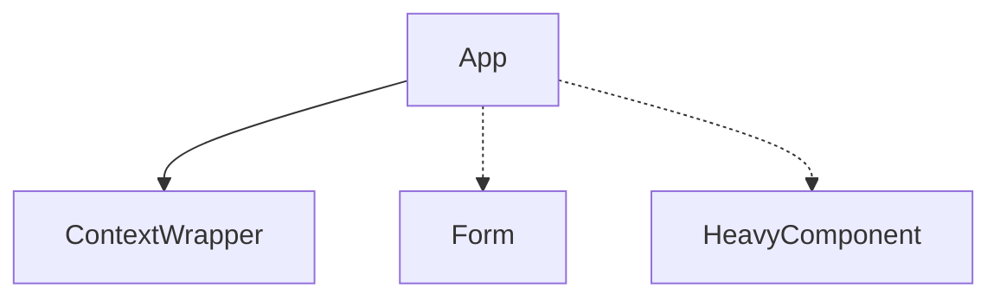
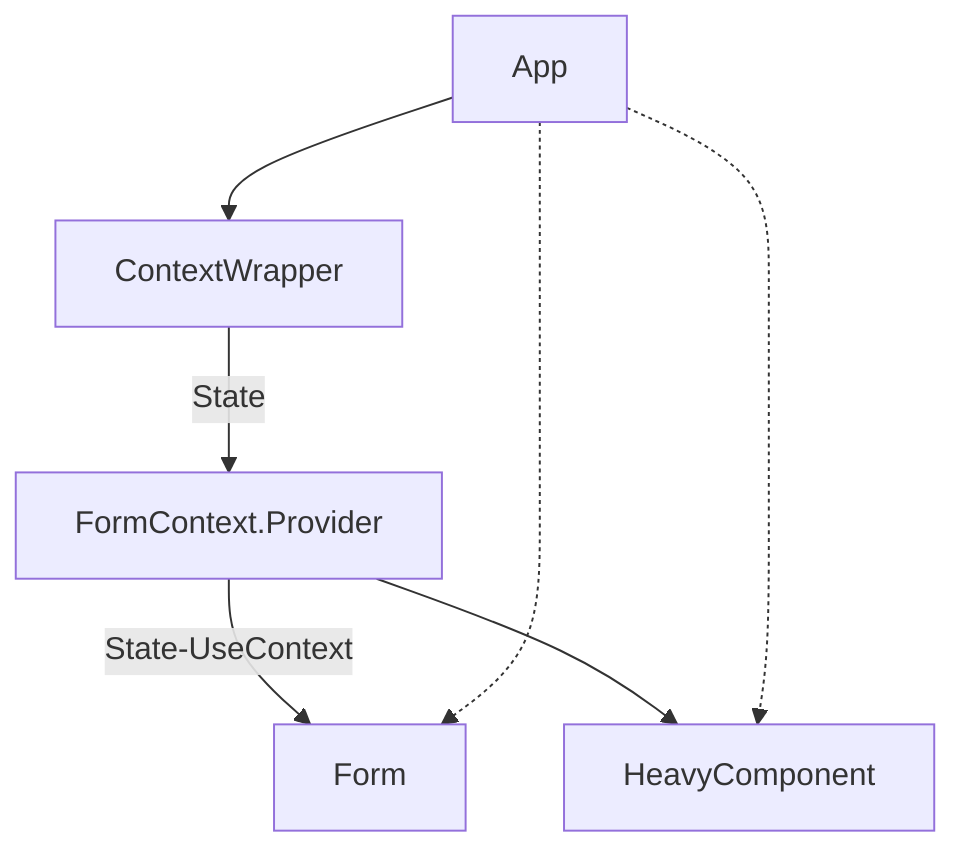
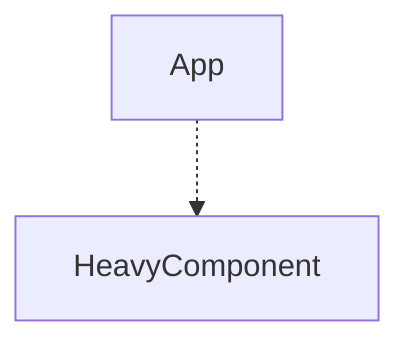

---
# try also 'default' to start simple
theme: seriph
# random image from a curated Unsplash collection by Anthony
# like them? see https://unsplash.com/collections/94734566/slidev
# some information about your slides, markdown enabled
title: Enhancing React Performance- Mastering Re-render Optimization
info: |
  ## React Next 2024
  Tal moskovich
# apply any unocss classes to the current slide
class: text-center
# https://sli.dev/custom/highlighters.html
highlighter: shiki
# https://sli.dev/guide/drawing
drawings:
  persist: false
# slide transition: https://sli.dev/guide/animations#slide-transitions
transition: slide-left
# enable MDC Syntax: https://sli.dev/guide/syntax#mdc-syntax
mdc: true
background: Hero.jpg
fonts:
  sans: rubik
---

# Enhancing React Performance: Mastering Re-render Optimization

## Tal Moskovich

<div class="flex pt-12 justify-center">
  
</div>

<style>
  h1
  {
    color: white;
    -webkit-text-fill-color: white;
  }
</style>

<!--
The last comment block of each slide will be treated as slide notes. It will be visible and editable in Presenter Mode along with the slide. [Read more in the docs](https://sli.dev/guide/syntax.html#notes)
-->

---
layout: center
transition: slide-down
---

# What Is the Most Joyful Thing in React?


<style>
  h1
  {
    font-size: 5rem;
    text-align: center;
    line-height: 6rem;
  }
</style>
---
layout: center
# class: bg-gradient-to-l from-purple-500 to-blue-400
transition: slide-down

---
# Avoiding Unnecessary <br> Re-rendering


<style>
  h1
  {
    font-size: 5rem;
    text-align: center;
    line-height: 6rem;
  }
</style>
---
layout: center
transition: slide-down

---

# Memoization
<div class="absolute left-120 top-20 inset-0 transform rotate-45 bg-red-500 w-4 h-100"></div>
<div class="absolute left-120 top-20 inset-0 transform -rotate-45 bg-red-500 w-4 h-100"></div>


<style>
  h1
  {
    font-size: 8rem;
    line-height: 9rem;
  }
</style>
---
layout: center
transition: slide-down

---

# React Compiler
<div class="absolute left-120 top-17 inset-0 transform rotate-45 bg-red-500 w-4 h-100"></div>
<div class="absolute left-120 top-17 inset-0 transform -rotate-45 bg-red-500 w-4 h-100"></div>


<style>
  h1
  {
    font-size: 6rem;
    line-height: 7rem;
  }
</style>
---
layout: center
transition: slide-down

---

# React Forget
<div class="absolute left-120 top-17 inset-0 transform rotate-45 bg-red-500 w-4 h-100"></div>
<div class="absolute left-120 top-17 inset-0 transform -rotate-45 bg-red-500 w-4 h-100"></div>


<style>
  h1
  {
    font-size: 6rem;
    line-height: 7rem;
  }
</style>
---
layout: center
transition: slide-down

---

# React Unforget
<div class="absolute left-120 top-17 inset-0 transform rotate-45 bg-red-500 w-4 h-100"></div>
<div class="absolute left-120 top-17 inset-0 transform -rotate-45 bg-red-500 w-4 h-100"></div>


<style>
  h1
  {
    font-size: 6rem;
    line-height: 7rem;
  }
</style>
---
layout: center

---

# Just Plain React!


<style>
  h1
  {
    font-size: 6rem;
    line-height: 7rem;
  }
</style>
---
layout: two-cols
class: self-center min-w-150 
---
# Hello, I'm Tal
<br>

🔥 **Committing Code &** <br>
**Pushing Personal Boundaries**

- 🧑‍💻 **Front-end Developer** @ Enpitech
- 🎧 **Podcaster & Lecturer** @ lotechni.dev
- 💡 **Proactivity Advocate**

<div class='flex pt-22 justify-start items-center'>


</div>

::right::


<style>
  p, li
  {
    font-size: 1.5rem;
    line-height: 2.25rem;
  }
</style>


---
transition: slide-down

---

# Let's Start with a Quick(?) Example

<v-click>
````md magic-move {lines: true}
```tsx {2}
function App() {
  const [state, setState] = useState({});
}
```
```tsx {5,6}
function App() {
  const [state, setState] = useState({});

  return (
    <FormContext.Provider value={[state, setState]}>
    </FormContext.Provider>
  );
}
```
```tsx {6,7}
function App() {
  const [state, setState] = useState({});

  return (
    <FormContext.Provider value={[state, setState]}>
        <Form />
        <HeavyComponent />
    </FormContext.Provider>
  );
}
```
```tsx
function Form() {
  const [state, setState] = useContext(FormContext);

  function handleChange(e) { ... }

  return (
      <input... />
  );
}
```
```tsx
function HeavyComponent() {
  busyWait(200);
  const randomNumber = Math.random() * 1000;
  return (
    <div>
      <span>Heavy Component</span>
      <span>{randomNumber.toFixed(2)}</span>
    </div>
  );
};
```
````
</v-click>

<style>
*{
    --slidev-code-font-size: 1.5rem;
    --slidev-code-line-height: var(--slidev-code-font-size)*1.5;
}
</style>

---
---
# Demo Time!
<iframe v-click src='http://localhost:3000' class='w-full h-110'></iframe>


---
layout: two-cols-header
class: absolute top-25
---

# So, What Do We Have Here?

::left::

<div class="absolute min-w-100 -ml-8">
````md magic-move {lines: true}
```tsx
function App() {
  return (
    ...
  );
}
```
```tsx {2,5,6}
function App() {
  const [state, setState] = useState({});

  return (
    <FormContext.Provider value={[state, setState]}>
    </FormContext.Provider>
  );
}
```
```tsx {6,7,12-15}
function App() {
  const [state, setState] = useState({});

  return (
    <FormContext.Provider value={[state, setState]}>
     <Form />
     <HeavyComponent />
    </FormContext.Provider>
  );
}

function Form() {
  const [state, setState] = useContext(FormContext);
  //...
}
```
```tsx {13}
function App() {
  const [state, setState] = useState({});

  return (
    <FormContext.Provider value={[state, setState]}>
     <Form />
     <HeavyComponent />
    </FormContext.Provider>
  );
}

function Form() {
  const [state, setState] = useContext(FormContext);
  //...
}
```
```tsx
//Re-rendering...
function App() {
  return (
    ...
  );
}
```
````
</div>

::right::
<div class='absolute left-185'>
<div class = 'flex justify-center items-start'>
<div class='absolute' v-click='[0, 1]'>


</div>
<div class='absolute' v-click='[1, 2]'>


</div>

<div class='absolute' v-click='[2, 4]'>


</div>
<div class='absolute' v-click='[4, 5]'>


</div>
</div>
</div>

<div class="absolute" v-click="[3, 4]">
<arrow x1="580" y1="380" x2="620" y2="330" color="#953" width="2" arrowSize="1" />
<p class="absolute top-82 left-135 transform text-orange-500 -rotate-50">Typing...</p>
</div>

<style>
*{
    --slidev-code-font-size: 1.1rem;
    --slidev-code-line-height: var(--slidev-code-font-size)*1.5;
}
</style>
---
transition: slide-down
---

# Maybe a Better One?

<div class="absolute top-25">
````md magic-move {lines: true}
```tsx{5,8,2}
function App() {
  const [state, setState] = useState({});

  return (
    <FormContext.Provider value={[state, setState]}>
        <Form />
        <HeavyComponent />
    </FormContext.Provider>
  );
}
```

```tsx{3,6}
function App() {
  return (
    <ContextWrapper>
        <Form />
        <HeavyComponent />
    </ContextWrapper>
  );
}
```

```tsx
function ContextWrapper({ children }) {
  const [state, setState] = useState({});

  return (
    <FormContext.Provider value={[state, setState]}>
      {children}
    </FormContext.Provider>
  );
}
```
````
</div>

<style>
*{
    --slidev-code-font-size: 1.5rem;
    --slidev-code-line-height: var(--slidev-code-font-size)*1.5;
}
</style>

---
---
# Demo Time!
<iframe v-click src='http://localhost:3000' class='w-full h-110'></iframe>

---
layout: two-cols-header
class: absolute top-15

---

<div class='-mt-6 -ml-8'>

# How Did We Get Here?

</div>

::left::
<div class="absolute min-w-100 -ml-8">
````md magic-move {lines: true}
```tsx
function App() {
  return (
    ...
  );
}
```

```tsx{3-6}
function App() {
  return (
    <ContextWrapper>
        <Form />
        <HeavyComponent />
    </ContextWrapper>
  );
}
```

```tsx{3,6,10-18}
function App() {
  return (
    <ContextWrapper>
        <Form />
        <HeavyComponent />
    </ContextWrapper>
  );
}

function ContextWrapper({ children }) {
  const [state, setState] = useState({});

  return (
    <FormContext.Provider value={[state, setState]}>
      {children}
    </FormContext.Provider>
  );
}
```
```tsx
function App() {
  return (
    <ContextWrapper>
        <Form />
        <HeavyComponent />
    </ContextWrapper>
  );
}

function ContextWrapper({ children }) {
  const [state, setState] = useState({});

  return (
    <FormContext.Provider value={[state, setState]}>
      {children}
    </FormContext.Provider>
  );
}
```
```tsx
function App() {
  return (
    <ContextWrapper>
        <Form /> //Re-rendered because context changing
        <HeavyComponent /> // 🤯 NOT RE-RENDERED
    </ContextWrapper>
  );
}

  /* Re-rendered because state changing */
function ContextWrapper({ children }) {
  const [state, setState] = useState({});

  return (
    <FormContext.Provider value={[state, setState]}>
      {children}
    </FormContext.Provider>
  );
}
```
````
</div>


::right::
<div class='absolute left-175'>
<div class = 'flex justify-center items-start'>
<div class='absolute' v-click='[0, 1]'>


</div>
<div class='absolute' v-click='[1, 2]'>


</div>

<div class='absolute' v-click='[2, 4]'>


</div>
<div class='absolute' v-click='[4, 5]'>


</div>
</div>
</div>
<div class="absolute" v-click="[3, 4]">
<arrow x1="600" y1="410" x2="650" y2="360" color="#953" width="2" arrowSize="1" />
<p class="absolute top-88 left-142 transform text-orange-500 -rotate-45">Typing...</p>
</div>

<style>
*{
    --slidev-code-font-size: 1rem;
    --slidev-code-line-height: var(--slidev-code-font-size)*1.5;
}
</style>
---
---

# How Isn't HeavyComponent Re-Rendered?

It's all about how React works!

<div class="min-w-10 mt-20">
````md magic-move {at:'1'}
```tsx
function Component(props) {
  return (...)
}
```

```tsx
function Component(props) {
  return (...)
}
```

```tsx
function Component({...}) {
  return (...)
}
```
```tsx
function Component({...}) {
  return (...)
}
```
```tsx
function Component
({children}:{children: ReactNode}) 
{
  return (...)
}
```
````
</div>
<div v-click="[1, 4]">
<arrow x1="580" y1="170" x2="580" y2="200" color="#953" width="2" arrowSize="1" />
<p class="absolute top-20 right-65 transform text-orange-500 text-center text-3xl" style="line-height: 2.25rem;">A reference to an object <br> in the Fiber node</p>
</div>
<div v-click='5'>
<arrow x1="750" y1="220" x2="750" y2="270" color="#953" width="2" arrowSize="1" />
<p class="absolute top-30 right-20 transform text-orange-500 text-center text-3xl" style="line-height: 2.25rem;">ReactNode is <br> actually a Fiber node</p>
</div>

<style>
*{
    --slidev-code-font-size: 2.5rem;
    --slidev-code-line-height: var(--slidev-code-font-size)*1.5;
}
</style>

<!--

- 🧳 **Props are Objects**

- 📂 **Props are saved in the Fiber nodes** (the "Virtual DOM")

Therefore:

- 🔄 **Props Objects are re-created on each render**

But what about `children`?

- 🧩 **Children can be considered as a reference to other (rendered) Fiber nodes**

- 🧬 **Children save their referential identity from the previous render**

Therefore:

- 🛡️ **Our HeavyComponent isn't re-rendered!**
-->
---
layout: two-cols-header
transition: slide-down

---

# Will It Also Work?

````md magic-move {lines: true}

```tsx{4,5}
function App() {
  return (
    <ContextWrapper>
        <Form />
        <HeavyComponent />
    </ContextWrapper>
  );
}
```
```tsx{4,5}
function App() {
  return (
    <ContextWrapper
        form={<Form />}
        heavyComponent={<HeavyComponent />}
    />
  );
}
```

```tsx{1,6,7}
function ContextWrapper({ form, heavyComponent }) {
  const [state, setState] = useState({});

  return (
    <FormContext.Provider value={[state, setState]}>
      {form}
      {heavyComponent}
    </FormContext.Provider>
  );
}
```
````

<style>
*{
    --slidev-code-font-size: 1.5rem;
    --slidev-code-line-height: var(--slidev-code-font-size)*1.5;
}
</style>


---
---
# Demo Time!
<iframe v-click src='http://localhost:3000' class='w-full h-110'></iframe>

---
---

<div class='-mt-7'>

# OK, But How?
Let's look at the code again:

</div>


````md magic-move {lines: true}
```tsx{none}
function App() {
  return (
    <ContextWrapper
        form={<Form />}
        heavyComponent={<HeavyComponent />} />
  );
}

function ContextWrapper({ form, heavyComponent }) {
  const [state, setState] = useState({});

  return (
    <FormContext.Provider value={[state, setState]}>
      {form}
      {heavyComponent}
    </FormContext.Provider>
  );
}
```
```tsx{4}
function App() {
  return (
    <ContextWrapper
        form={<Form />}
        heavyComponent={<HeavyComponent />} />
  );
}

function ContextWrapper({ form, heavyComponent }) {
  const [state, setState] = useState({});

  return (
    <FormContext.Provider value={[state, setState]}>
      {form}
      {heavyComponent}
    </FormContext.Provider>
  );
}
```
```tsx{5}
function App() {
  return (
    <ContextWrapper
        form={<Form />}
        heavyComponent={<HeavyComponent />} />
  );
}

function ContextWrapper({ form, heavyComponent }) {
  const [state, setState] = useState({});

  return (
    <FormContext.Provider value={[state, setState]}>
      {form}
      {heavyComponent}
    </FormContext.Provider>
  );
}
```
```tsx{15,14}
function App() {
  return (
    <ContextWrapper
        form={<Form />}
        heavyComponent={<HeavyComponent />} />
  );
}

function ContextWrapper({ form, heavyComponent }) {
  const [state, setState] = useState({});

  return (
    <FormContext.Provider value={[state, setState]}>
      {form}
      {heavyComponent}
    </FormContext.Provider>
  );
}
```
```tsx{14}
function App() {
  return (
    <ContextWrapper
        form={<Form />}
        heavyComponent={<HeavyComponent />} />
  );
}

function ContextWrapper({ form, heavyComponent }) {
  const [state, setState] = useState({});

  return (
    <FormContext.Provider value={[state, setState]}>
      {form}
      {heavyComponent}
    </FormContext.Provider>
  );
}
```
```tsx{3,4,9,14}
function App() {
  return (
    <ContextWrapper
        form={<Form />}
        heavyComponent={<HeavyComponent />} />
  );
}

function ContextWrapper({ form, heavyComponent }) {
  const [state, setState] = useState({});

  return (
    <FormContext.Provider value={[state, setState]}>
      {form}
      {heavyComponent}
    </FormContext.Provider>
  );
}
```
````
<div v-click="[1, 2]">
<arrow x1="380" y1="195" x2="330" y2="195" color="#953" width="2" arrowSize="1" />
<p class="absolute top-42 left-98 text-orange-500 text-center">`form` gets a rendered (ReactNode) value</p>
</div>
<div v-click="[2, 3]">
<arrow x1="620" y1="216" x2="560" y2="216" color="#953" width="2" arrowSize="1" />
<p class="absolute top-47 left-155 text-orange-500 text-center">`heavyComponent` gets a <br> rendered (ReactNode) value</p>
</div>
<div v-click="[3,4]">
<arrow x1="370" y1="445" x2="320" y2="445" color="#953" width="2" arrowSize="1" />
<p class="absolute bottom-20 left-95 text-orange-500 text-center">'form' and 'heavyComponent' serves as slots</p>
</div>
<div v-click="[4,5]">
<arrow x1="370" y1="435" x2="320" y2="435" color="#953" width="2" arrowSize="1" />
<p class="absolute bottom-23 left-95 text-orange-500 text-center">Typing in 'form' initiates state change</p>
</div>
<div v-click="[5,6]">
<p class="absolute bottom-64 left-75 text-orange-500 text-center">Only 'Form' and 'ContextWrapper' are re-rendered! <br>And 'HeavyComponent' is "memoized"!</p>
</div>

<style>
*{
    --slidev-code-font-size: 1rem;
    --slidev-code-line-height: var(--slidev-code-font-size)*1.5;
}
</style>

---
layout: image-right
image: /developer.webp
---

# From Props Drilling to Component Drilling

<v-clicks>
 
 - If you give React the same element you gave it on the last render, **it won't bother re-rendering** that element.
 
 - "Lift" the expensive component to a parent where it will be rendered **less often**.
 
 - Then pass the expensive component **down as a prop**.

</v-clicks>

<style>
  p
  {
    font-size: 1.5rem;
    line-height: 2.25rem;
  }
</style>

---
layout: image-right
image: '/lecture.png'
---
# Thanks For Listening!
## Tal Moskovich

<p class='text-center'><a href='https://github.com/talmoskovich/ReactNext2024'>Code & Slides repo</a></p>

<p class='text-center'><a href='https://tmosko.com/hello'>Contact Me</a></p>

